# User Guide for Defining Dimensional XBRL-GL Taxonomy and Structured CSV

This guide describes how to use the provided Python scripts and data to define a dimensional XBRL-GL taxonomy and convert instance documents into structured xBRL-CSV files. Two alternative workflows are supported depending on whether you are starting from an existing taxonomy (Palette-based) or defining a semantic model from scratch (FSM-based).

---

## 🔁 Two Alternative Workflows

### ◼ Approach 1: From Existing Palette Taxonomy

**Best for:** Reverse engineering or extending the 2016 PWD taxonomy.

#### Step 1: Parse the Palette Taxonomy
```bash
python xBRLGL_ParseTaxonomy.py \
  --base-dir gl \
  --palette case-c-b-m-u-e-t-s \
  --output LHM/XBRL_GL_LHM.csv \
  --lang ja \
  --trace \
  --debug
```

#### Step 2: Generate Dimensional Taxonomy from Parsed LHM
```bash
python xBRLGL_TaxonomyGenerator.py \
  LHM/XBRL_GL_LHM.csv \
  -b gl-case-c-b-m-u-e-t-s \
  -r AccntgEntrs \
  -l ja \
  -c JPY \
  -e utf-8-sig \
  -d -v
```

---

### ◼ Approach 2: From FSM → BSM → LHM via Graph Walk

**Best for:** Creating a new taxonomy from semantic model definitions.

#### Step 1: Specialization (FSM → BSM)
```bash
python specialization.py \
  FSM/XBRL-GL_2025_FSMa.csv \
  BSM/XBRL-GL_2025_BSMa.csv \
  -s FSM/XBRL-GL_2025_FSM_JPN.csv \
  -l BSM/XBRL-GL_2025_BSM_JPN.csv \
  -t -d
```

#### Step 2: Graph Walk (BSM → LHM)
```bash
python graphwalk.py \
  BSM/XBRL-GL_2025_BSMa.csv \
  LHM/XBRL-GL_2025_LHMa.csv \
  -r "Accounting Entries+Accounting Entries JPN" \
  -l BSM/XBRL-GL_2025_BSM_JPN.csv \
  -m LHM/XBRL-GL_2025_LHM_JPN.csv \
  -t -d
```

#### Step 3: Generate Dimensional Taxonomy from LHM
```bash
python xBRLGL_TaxonomyGenerator.py \
  LHM/XBRL-GL_2025_LHMa.csv \
  -b gl-2025 \
  -r "Accntg Entrs" \
  -l ja \
  -c JPY \
  -e utf-8-sig \
  -d -v
```

---

## 🔧 Flow Chart

### Process Overview (Mermaid Format)

```mermaid
flowchart TD
  Start(["Start"])

  subgraph Palette
    P1["Select base XSD and label files"]
    P2["Run xBRLGL_ParseTaxonomy.py"]
    P3["Generate LHM CSV"]
  end

  subgraph Semantic
    S1["Define FSM CSV (base + extensions)"]
    S2["Run specialization.py → BSM"]
    S3["Run graphwalk.py → LHM"]
  end

  Common["Run xBRLGL_TaxonomyGenerator.py
Generate XSD, JSON, Skeleton CSV"]
  Convert["Run xBRLGL_StructuredCSV.py
(Requires instance XML e.g., Vendor_Invoices.xml)
Convert XML to structured CSV"]
  Output(["Structured xBRL-CSV Output"])

  Start --> P1 --> P2 --> P3 --> Common
  Start --> S1 --> S2 --> S3 --> Common
  Common --> Convert --> Output
```



## 📤 Structured CSV Conversion (xBRL-CSV)

Convert XBRL GL instance XML into structured xBRL-CSV:
```bash
python xBRLGL_StructuredCSV.py \
  -i ids/Customer_Invoices.xml \
  -n 2025-12-01 \
  -s LHM/XBRL_GL_LHM.csv \
  -o OIM/Customer_Invoices.csv \
  -e utf-8-sig \
  -d -v
```

---

## 📦 GitHub Repository Directory Structure

This guide assumes you are working from a GitHub repository with the following structure:

```
├── README.md
├── LICENSE
├── docs/
│   ├── user-guide.adoc            # Full AsciiDoc guide (generated from your canvas)
│   ├── images/                    # Diagrams or UML exports if needed
│   └── examples/                  # Mini walkthroughs or sample runs
├── scripts/                       # Core Python scripts
│   ├── specialization.py
│   ├── graphwalk.py
│   ├── xBRLGL_ParseTaxonomy.py
│   ├── xBRLGL_TaxonomyGenerator.py
│   └── xBRLGL_StructuredCSV.py
├── launch.json                    # VS Code config
├── taxonomy/
│   ├── FSM/
│   ├── BSM/
│   ├── LHM/
│   ├── gl/                        # XBRL schema files
│   └── OIM/                       # Output xBRL-CSV and JSON
├── ids/                           # Sample instance documents (input)
├── output/                        # Generated taxonomy and CSV files
├── metadata/                      # JSON schema metadata, labels, etc.
└── tests/                         # (Optional) Pytest-compatible test cases
```bash
unzip XBRL-GL-202504-17.zip -d ./XBRL-GL-2025/
cd XBRL-GL-2025/
```

---

## 🛠 Script Functions Explained

### `specialization.py`
- **Input:** FSM CSV, optional extension FSM
- **Output:** BSM CSV, optional extension BSM
- **Purpose:** Handles specialization and property extension. Converts FSM to BSM using class hierarchy and multiplicity rules.

### `graphwalk.py`
- **Input:** BSM CSV, root class term(s)
- **Output:** LHM CSV
- **Purpose:** Performs graph traversal on BSM associations and compositions to create a logical hierarchical model (LHM).

### `xBRLGL_ParseTaxonomy.py`
- **Input:** Existing palette XSD and label files
- **Output:** LHM-style CSV
- **Purpose:** Parses legacy taxonomy into a structured semantic path format suitable for modern LHM generation.

### `xBRLGL_TaxonomyGenerator.py`
- **Input:** LHM CSV, root class term(s)
- **Output:**
  - XSD files (palette + dimensional schema)
  - JSON metadata file
  - Header-only skeleton CSV
- **Purpose:** Generates dimensional XBRL-GL taxonomy from LHM.

### `xBRLGL_StructuredCSV.py`
- **Input:** XBRL GL XML instance + LHM CSV
- **Output:** xBRL-CSV file (structured CSV)
- **Purpose:** Converts GL instance data into structured CSV using JSON metadata and semantic paths.

---

```

---

## 🚀 Quick VS Code Launch
- Open the folder in Visual Studio Code
- Use `launch.json` to run any workflow (preconfigured examples)
